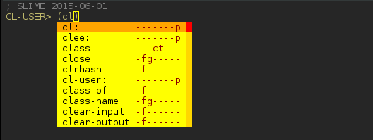

slime-company
=============

A [company-mode](https://company-mode.github.io) completion backend for
[Slime](https://github.com/slime/slime), "The Superior Lisp Interaction Mode for Emacs".



## Setup

The recommended way to install `slime-company` is via
[MELPA](http://melpa.org/#/slime-company). If not using MELPA, put
this file somewhere into your load-path (or just into slime-path/contribs).

To activate the contrib add it to the `slime-setup` call in your `.emacs`

```el
(slime-setup '(slime-fancy slime-company))
```

You may also want to `M-x customize-group slime-company` to select the
completion method and the major modes where `slime-company` is
automatically activated.

The following bindings for `company-active-map` will add the usual
navigation keys to the completion menu:

```el
(define-key company-active-map (kbd "\C-n") 'company-select-next)
(define-key company-active-map (kbd "\C-p") 'company-select-previous)
(define-key company-active-map (kbd "\C-d") 'company-show-doc-buffer)
(define-key company-active-map (kbd "M-.") 'company-show-location)
```
